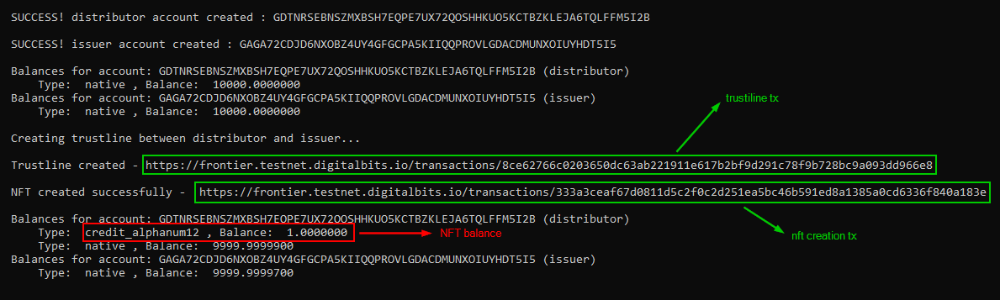
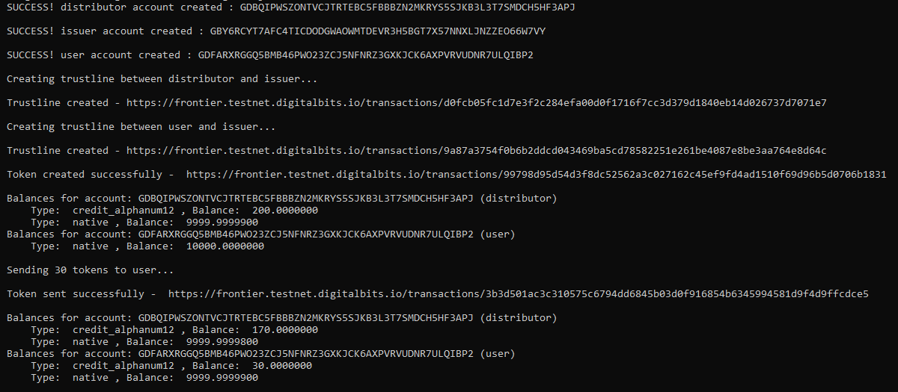
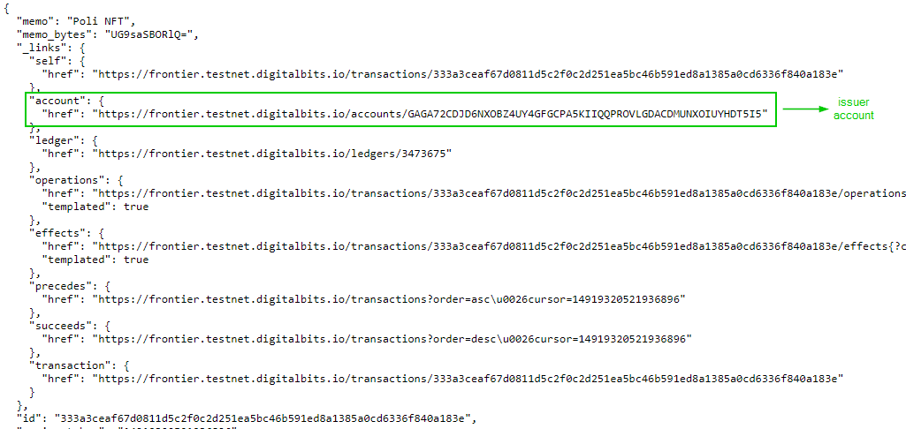
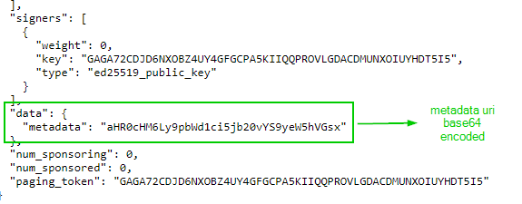

## Getting started

```
npm i
```
then
```
npm run nft
```
or
```
npm run fungible
```

## Actions performed

### NFT Creation

1. Generate two random accounts, one will be the distributor and the other will be the issuer
2. Create a trustline between the distributor and the issuer (distributor is the signer here)
3. Send the transaction to mint the new NFT, this is like a payment in the new asset from the issuer to the distributor (issuer is the signer here). Digitalbits offers the possibility to attach key-value pairs to accounts, so in this case the NFT metadata (here a photo URL) is added directly to issuer account with key `metadata` and value https://imgur.com/a/rynaTk1

### Fungible token creation

1. Generate three random accounts, one will be the distributor, one will be the issuer and one will be the user
2. Create a trustline between the distributor and the issuer (distributor is the signer here) and between the user and the issuer (user is the signer here)
3. Send the transaction to mint the new tokens, this is like a payment in the new asset from the issuer to the distributor (issuer is the signer here). Digitalbits offers the possibility to attach key-value pairs to accounts, so in this case the NFT metadata (here a photo URL) is added directly to issuer account with key `metadata` and value https://imgur.com/a/rynaTk1
4. Send some tokens from the distributor to the user

## Example

This is an example of execution of ```nft.js```:

       

This is an example of execution of ```fungible.js```:

     

The NFT/token creation transaction can be opened in the browser to find issuer's account page URL:       



Metadata URL can be found inside issuer's account page:


